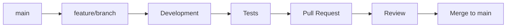

# 🤝 Guide de Contribution

Merci de votre intérêt pour contribuer à l'API Async Email ! Ce guide vous aidera à comprendre comment contribuer efficacement au projet.

## 📋 Table des Matières

- [Code de Conduite](#code-de-conduite)
- [Comment Contribuer](#comment-contribuer)
- [Processus de Développement](#processus-de-développement)
- [Standards de Code](#standards-de-code)
- [Tests](#tests)
- [Documentation](#documentation)
- [Questions et Support](#questions-et-support)

## 📜 Code de Conduite

### Nos Engagements

Nous nous engageons à offrir un environnement accueillant et inclusif pour tous, indépendamment de :

- L'âge, la taille, le handicap, l'ethnicité
- L'identité et l'expression de genre
- Le niveau d'expérience, la nationalité
- L'apparence personnelle, la race, la religion
- L'identité et l'orientation sexuelles

### Comportements Acceptables

- Utiliser un langage accueillant et inclusif
- Respecter les points de vue et expériences différents
- Accepter gracieusement les critiques constructives
- Se concentrer sur ce qui est le mieux pour la communauté
- Faire preuve d'empathie envers les autres membres

### Comportements Inacceptables

- L'utilisation de langage ou d'images sexualisés
- Le trolling, les commentaires insultants ou désobligeants
- Le harcèlement public ou privé
- La publication d'informations privées sans permission
- Tout autre comportement inapproprié dans un contexte professionnel

## 🚀 Comment Contribuer

### 1. Fork et Clone

```bash
# Fork le repository sur GitHub
# Puis clonez votre fork
git clone https://github.com/votre-username/async-email-api.git
cd async-email-api

# Ajoutez le repository original comme remote
git remote add upstream https://github.com/original-owner/async-email-api.git
```

### 2. Créer une Branche

```bash
# Créez une branche pour votre feature
git checkout -b feature/nom-de-votre-feature

# Ou pour un bugfix
git checkout -b fix/description-du-bug
```

### 3. Développement

```bash
# Démarrer l'environnement de développement
docker-compose up -d

# Installer les dépendances
docker-compose exec php composer install

# Lancer les tests
docker-compose exec php php bin/phpunit
```

### 4. Commit et Push

```bash
# Ajouter vos modifications
git add .

# Commit avec un message descriptif
git commit -m "feat: add email template support"

# Push vers votre fork
git push origin feature/nom-de-votre-feature
```

### 5. Pull Request

1. Allez sur GitHub
2. Cliquez sur "New Pull Request"
3. Sélectionnez votre branche
4. Remplissez le template de PR
5. Attendez la review

## 🔄 Processus de Développement

### Workflow Git



### Types de Branches

- **`main`** : Branche principale, toujours stable
- **`feature/*`** : Nouvelles fonctionnalités
- **`fix/*`** : Corrections de bugs
- **`docs/*`** : Documentation
- **`refactor/*`** : Refactoring
- **`test/*`** : Amélioration des tests

### Convention de Nommage

```bash
# Fonctionnalités
feature/user-authentication
feature/email-templates
feature/analytics-dashboard

# Corrections
fix/validation-error
fix/memory-leak
fix/security-vulnerability

# Documentation
docs/api-documentation
docs/deployment-guide
docs/architecture-overview
```

## 📝 Standards de Code

### PHP

```php
<?php

namespace App\Service;

use App\Document\Email;
use Doctrine\ODM\MongoDB\DocumentManager;

/**
 * Service de gestion des emails
 */
class EmailService
{
    private DocumentManager $documentManager;

    public function __construct(DocumentManager $documentManager)
    {
        $this->documentManager = $documentManager;
    }

    /**
     * Envoie un email de manière asynchrone
     *
     * @param string $to Adresse email du destinataire
     * @param string $subject Sujet de l'email
     * @param string $body Contenu de l'email
     * @return string ID de suivi unique
     * @throws \InvalidArgumentException Si les paramètres sont invalides
     */
    public function queueEmail(string $to, string $subject, string $body): string
    {
        // Validation des paramètres
        if (empty($to) || !filter_var($to, FILTER_VALIDATE_EMAIL)) {
            throw new \InvalidArgumentException('Invalid email address');
        }

        // Logique métier...
        return $trackingId;
    }
}
```

### Règles de Formatage

1. **PSR-12** : Standard de codage PHP
2. **Indentation** : 4 espaces (pas de tabs)
3. **Longueur de ligne** : Maximum 120 caractères
4. **Nommage** : camelCase pour les variables, PascalCase pour les classes
5. **Commentaires** : PHPDoc pour toutes les méthodes publiques

### Configuration PHP-CS-Fixer

```json
{
    "php-cs-fixer": {
        "rules": {
            "@PSR12": true,
            "array_syntax": {"syntax": "short"},
            "ordered_imports": {"sort_algorithm": "alpha"},
            "no_unused_imports": true,
            "not_operator_with_successor_space": true,
            "trailing_comma_in_multiline": true,
            "phpdoc_scalar": true,
            "unary_operator_spaces": true,
            "binary_operator_spaces": true,
            "blank_line_before_statement": {
                "statements": ["break", "continue", "declare", "return", "throw", "try"]
            }
        }
    }
}
```

## 🧪 Tests

### Structure des Tests

```
tests/
├── Unit/                    # Tests unitaires
│   ├── Service/
│   ├── Controller/
│   └── Document/
├── Integration/             # Tests d'intégration
│   ├── Api/
│   └── Database/
├── Functional/              # Tests fonctionnels
│   └── EmailFlowTest.php
└── Fixtures/               # Données de test
    └── EmailFixtures.php
```

### Exemple de Test

```php
<?php

namespace App\Tests\Unit\Service;

use App\Service\EmailService;
use Doctrine\ODM\MongoDB\DocumentManager;
use PHPUnit\Framework\TestCase;

class EmailServiceTest extends TestCase
{
    private EmailService $emailService;
    private DocumentManager $documentManager;

    protected function setUp(): void
    {
        $this->documentManager = $this->createMock(DocumentManager::class);
        $this->emailService = new EmailService($this->documentManager);
    }

    public function testQueueEmailWithValidData(): void
    {
        // Arrange
        $to = 'test@example.com';
        $subject = 'Test Subject';
        $body = 'Test Body';

        // Act
        $trackingId = $this->emailService->queueEmail($to, $subject, $body);

        // Assert
        $this->assertNotEmpty($trackingId);
        $this->assertStringStartsWith('email_', $trackingId);
    }

    public function testQueueEmailWithInvalidEmail(): void
    {
        // Arrange
        $invalidEmail = 'invalid-email';

        // Act & Assert
        $this->expectException(\InvalidArgumentException::class);
        $this->expectExceptionMessage('Invalid email address');
        
        $this->emailService->queueEmail($invalidEmail, 'Subject', 'Body');
    }
}
```

### Lancer les Tests

```bash
# Tous les tests
docker-compose exec php php bin/phpunit

# Tests spécifiques
docker-compose exec php php bin/phpunit tests/Unit/Service/EmailServiceTest.php

# Avec couverture de code
docker-compose exec php php bin/phpunit --coverage-html coverage/
```

### Couverture de Code

- **Minimum** : 80% de couverture
- **Objectif** : 90% de couverture
- **Tests critiques** : 100% de couverture

## 📚 Documentation

### Types de Documentation

1. **README.md** : Vue d'ensemble du projet
2. **docs/API.md** : Documentation de l'API
3. **docs/ARCHITECTURE.md** : Architecture du système
4. **docs/DEPLOYMENT.md** : Guide de déploiement
5. **docs/CONTRIBUTING.md** : Guide de contribution

### Standards de Documentation

- **Markdown** : Format standard
- **Exemples** : Code d'exemple pour chaque fonctionnalité
- **Images** : Diagrammes et captures d'écran
- **Liens** : Liens vers les ressources externes

### Exemple de Documentation

```markdown
## 📧 Envoi d'Email

### Description
Envoie un email de manière asynchrone via l'API.

### Endpoint
```
POST /emails
```

### Paramètres
| Paramètre | Type | Requis | Description |
|-----------|------|--------|-------------|
| `to` | string | ✅ | Adresse email du destinataire |
| `subject` | string | ✅ | Sujet de l'email |
| `body` | string | ✅ | Contenu de l'email |

### Exemple
```bash
curl -X POST http://localhost:8000/emails \
  -H "Content-Type: application/json" \
  -d '{"to": "user@example.com", "subject": "Test", "body": "Hello!"}'
```

### Réponse
```json
{
  "message": "Email queued successfully",
  "tracking_id": "email_1234567890"
}
```
```

## 🐛 Signaler un Bug

### Template de Bug Report

```markdown
## 🐛 Description du Bug
Description claire et concise du problème.

## 🔄 Étapes pour Reproduire
1. Aller à '...'
2. Cliquer sur '...'
3. Faire défiler vers '...'
4. Voir l'erreur

## 🎯 Comportement Attendu
Description de ce qui devrait se passer.

## 📱 Environnement
- OS: [ex: Windows 10, macOS 10.15, Ubuntu 20.04]
- Version PHP: [ex: 8.2.0]
- Version Symfony: [ex: 6.4.0]
- Version Docker: [ex: 20.10.0]

## 📸 Captures d'Écran
Si applicable, ajoutez des captures d'écran.

## 📋 Logs
```
Paste any relevant logs here
```
```

## ✨ Proposer une Fonctionnalité

### Template de Feature Request

```markdown
## 🚀 Fonctionnalité Demandée
Description claire et concise de la fonctionnalité.

## 💡 Motivation
Pourquoi cette fonctionnalité est-elle nécessaire ?

## 📝 Description Détaillée
Description détaillée de la fonctionnalité.

## 🎯 Cas d'Usage
Décrivez les cas d'usage concrets.

## 🔄 Alternatives Considérées
Décrivez les alternatives que vous avez considérées.

## 📋 Critères d'Acceptation
- [ ] Critère 1
- [ ] Critère 2
- [ ] Critère 3
```

## 🔍 Review Process

### Checklist pour les PR

- [ ] Code respecte les standards PSR-12
- [ ] Tests unitaires ajoutés/modifiés
- [ ] Tests passent avec succès
- [ ] Documentation mise à jour
- [ ] Pas de conflits de merge
- [ ] Description claire de la PR

### Processus de Review

1. **Automated Checks** : Tests et linting automatiques
2. **Code Review** : Review par au moins un maintainer
3. **Testing** : Tests manuels si nécessaire
4. **Approval** : Approbation pour merge
5. **Merge** : Merge dans la branche principale

## 📞 Questions et Support

### Canaux de Communication

- **GitHub Issues** : Bugs et feature requests
- **GitHub Discussions** : Questions générales
- **Email** : contact@example.com

### Ressources Utiles

- [Documentation Symfony](https://symfony.com/doc)
- [Documentation MongoDB](https://docs.mongodb.com)
- [Documentation RabbitMQ](https://www.rabbitmq.com/documentation.html)
- [Documentation Docker](https://docs.docker.com)

## 🏆 Reconnaissance

### Contributors

Merci à tous les contributeurs qui ont aidé à améliorer ce projet !

### Hall of Fame

- [@contributor1](https://github.com/contributor1) - Feature X
- [@contributor2](https://github.com/contributor2) - Bug fix Y
- [@contributor3](https://github.com/contributor3) - Documentation Z

---

Merci de contribuer à l'API Async Email ! 🚀
