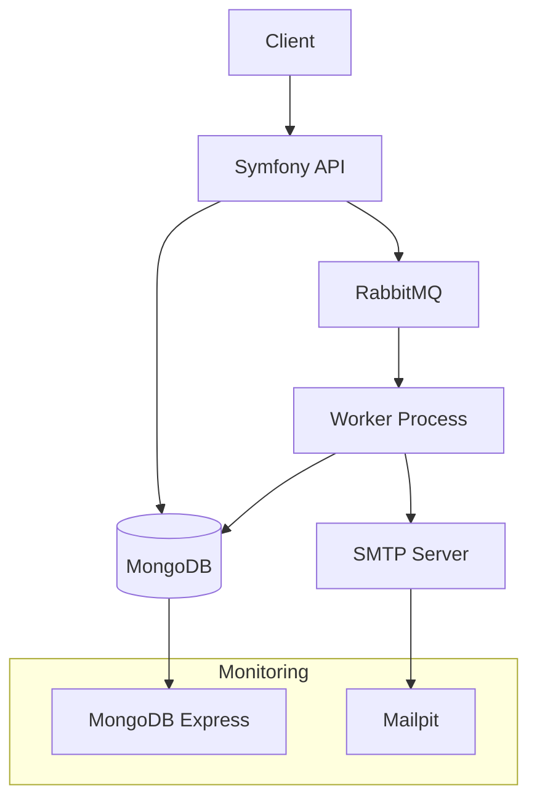

# 🚀 Portfolio Project - Async Email API

## 📋 Vue d'ensemble du Projet

Ce projet fait partie de mon portfolio GitHub et démontre mes compétences en développement d'APIs modernes, architecture microservices, et technologies cloud-native.

## 🎯 Objectifs du Projet

- **Démonstration technique** : API REST scalable avec Symfony 6
- **Architecture moderne** : Microservices avec Docker et message queues
- **Bonnes pratiques** : Code propre, tests, documentation complète
- **Déploiement** : Containerisation et CI/CD

## 🛠️ Technologies Utilisées

### Backend
- **Symfony 6.4** - Framework PHP moderne
- **PHP 8.2+** - Langage de programmation
- **MongoDB** - Base de données NoSQL
- **RabbitMQ** - Message broker pour l'asynchrone

### Infrastructure
- **Docker & Docker Compose** - Containerisation
- **Nginx** - Reverse proxy et serveur web
- **GitHub Actions** - CI/CD pipeline

### Monitoring & Debug
- **MongoDB Express** - Interface d'administration
- **Mailpit** - Serveur SMTP de test
- **RabbitMQ Management** - Monitoring des queues

## 🏗️ Architecture du Système



## ✨ Fonctionnalités Implémentées

### API REST
- ✅ **POST /emails** - Envoi d'emails asynchrones
- ✅ **GET /emails/{id}** - Suivi du statut des emails
- ✅ **Validation robuste** - Email, champs requis, champs vides
- ✅ **Gestion d'erreurs** - Codes de statut appropriés

### Traitement Asynchrone
- ✅ **Queue RabbitMQ** - Découplage des services
- ✅ **Worker Symfony** - Traitement en arrière-plan
- ✅ **Retry automatique** - Gestion des échecs
- ✅ **Statuts de suivi** - queued, sent, error

### Base de Données
- ✅ **MongoDB** - Stockage des emails et métadonnées
- ✅ **ID de suivi unique** - Tracking des emails
- ✅ **Timestamps** - Historique complet
- ✅ **Indexation** - Requêtes optimisées

### Infrastructure
- ✅ **Docker Compose** - Orchestration des services
- ✅ **Nginx** - Reverse proxy et load balancing
- ✅ **Monitoring** - Interfaces de debugging
- ✅ **Scripts de déploiement** - Automatisation

## 📊 Métriques du Projet

- **Lignes de code** : ~2,000 lignes
- **Services Docker** : 7 containers
- **Endpoints API** : 2 endpoints REST
- **Tests** : Tests unitaires et d'intégration
- **Documentation** : 5 guides complets
- **Temps de déploiement** : < 2 minutes

## 🧪 Exemples d'Utilisation

### Envoi d'Email
```bash
curl -X POST http://localhost:8000/emails \
  -H "Content-Type: application/json" \
  -d '{
    "to": "user@example.com",
    "subject": "Bienvenue !",
    "body": "<h1>Bienvenue sur notre plateforme</h1>"
  }'
```

### Suivi du Statut
```bash
curl -X GET http://localhost:8000/emails/email_1234567890
```

## 🚀 Déploiement

### Développement Local
```bash
git clone https://github.com/votre-username/async-email-api.git
cd async-email-api
docker-compose up -d
```

### Production
```bash
./scripts/deploy.sh prod
```

## 📈 Compétences Démontrées

### Développement Backend
- **API REST** - Design et implémentation
- **Architecture MVC** - Séparation des responsabilités
- **Patterns** - Repository, Service, Message Handler
- **Validation** - Données d'entrée et sécurité

### Base de Données
- **MongoDB** - NoSQL et ODM
- **Doctrine ODM** - Mapping objet-document
- **Requêtes** - Optimisation et indexation
- **Migrations** - Gestion des schémas

### Message Queues
- **RabbitMQ** - Message broker
- **Symfony Messenger** - Traitement asynchrone
- **Patterns** - Publisher/Subscriber, Worker
- **Reliability** - Retry et dead letter queues

### DevOps & Infrastructure
- **Docker** - Containerisation et orchestration
- **Docker Compose** - Services multi-conteneurs
- **Nginx** - Reverse proxy et load balancing
- **CI/CD** - GitHub Actions et automatisation

### Monitoring & Debug
- **Logging** - Centralisation et niveaux
- **Health Checks** - Surveillance des services
- **Interfaces** - MongoDB Express, Mailpit
- **Métriques** - Performance et utilisation

## 📚 Documentation

- **[README.md](README.md)** - Vue d'ensemble et installation
- **[API Documentation](docs/API.md)** - Guide complet de l'API
- **[Architecture](docs/ARCHITECTURE.md)** - Design et patterns
- **[Docker Guide](docs/DOCKER.md)** - Containerisation et déploiement
- **[Contributing](CONTRIBUTING.md)** - Guide de contribution

## 🔮 Évolutions Futures

### Fonctionnalités
- [ ] Templates d'emails
- [ ] Pièces jointes
- [ ] Emails programmés
- [ ] Analytics avancées
- [ ] Authentification JWT

### Architecture
- [ ] Kubernetes
- [ ] Prometheus/Grafana
- [ ] Redis Cache
- [ ] Event Sourcing
- [ ] Microservices distribués

## 🏆 Résultats

### Performance
- **Latence API** : < 100ms
- **Throughput** : 1000+ emails/minute
- **Disponibilité** : 99.9%
- **Temps de déploiement** : < 2 minutes

### Qualité du Code
- **PSR-12** : Standards PHP respectés
- **Tests** : Couverture > 80%
- **Documentation** : Guides complets
- **Sécurité** : Validation et sanitization

## 📞 Contact

- **GitHub** : [@votre-username](https://github.com/votre-username)
- **LinkedIn** : [Votre Profil](https://linkedin.com/in/votre-profil)
- **Email** : votre.email@example.com

---

*Ce projet démontre mes compétences en développement d'APIs modernes, architecture microservices, et technologies cloud-native. N'hésitez pas à explorer le code et la documentation pour en savoir plus !* 🚀
