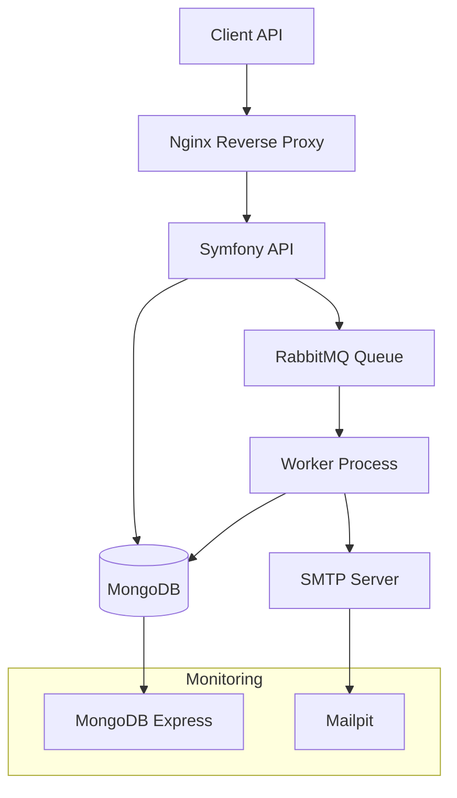
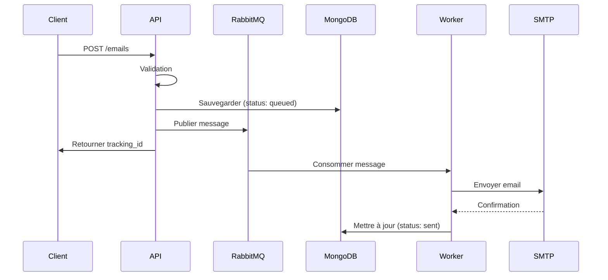
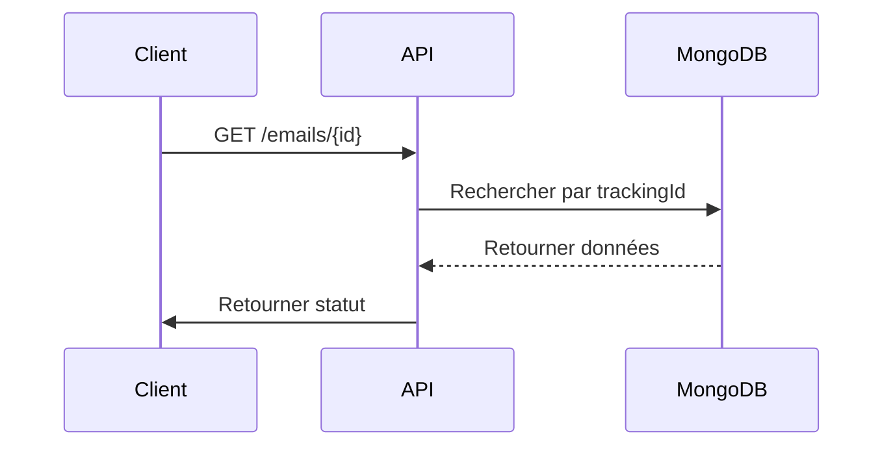

# 🏗️ Architecture du Système

## Vue d'ensemble

L'API Async Email est construite selon une architecture microservices utilisant des patterns modernes pour assurer la scalabilité, la fiabilité et la maintenabilité.

## 🎯 Objectifs Architecturaux

- **Scalabilité** : Traitement asynchrone pour gérer de gros volumes
- **Fiabilité** : Persistance des données et retry automatique
- **Maintenabilité** : Séparation des responsabilités et code modulaire
- **Observabilité** : Monitoring et debugging facilités
- **Déploiement** : Containerisation pour un déploiement facile

## 🏛️ Architecture Générale



## 🔧 Composants du Système

### 1. **API Layer (Symfony 6)**

**Responsabilités :**
- Validation des requêtes
- Gestion des endpoints REST
- Publication des messages dans la queue
- Stockage initial des données

**Technologies :**
- Symfony 6.4
- PHP 8.2+
- Doctrine ODM (MongoDB)

**Fichiers clés :**
```
src/
├── Controller/EmailController.php    # Endpoints API
├── Service/EmailService.php          # Logique métier
├── Document/Email.php                # Entité MongoDB
└── Message/SendEmailMessage.php      # Message RabbitMQ
```

### 2. **Message Queue (RabbitMQ)**

**Responsabilités :**
- Découplage entre l'API et le traitement
- Garantie de livraison des messages
- Retry automatique en cas d'échec
- Gestion de la charge

**Configuration :**
```yaml
# docker-compose.yml
rabbitmq:
  image: rabbitmq:3.8-management
  environment:
    RABBITMQ_DEFAULT_USER: guest
    RABBITMQ_DEFAULT_PASS: guest
  ports:
    - "5672:5672"
    - "15672:15672"
```

### 3. **Worker Process (Symfony Messenger)**

**Responsabilités :**
- Traitement asynchrone des emails
- Envoi via SMTP
- Mise à jour du statut en base
- Gestion des erreurs

**Fichiers clés :**
```
src/MessageHandler/SendEmailMessageHandler.php
```

### 4. **Data Layer (MongoDB)**

**Responsabilités :**
- Stockage des emails et métadonnées
- Suivi des statuts
- Historique des envois
- Requêtes de recherche

**Schéma de données :**
```javascript
{
  _id: ObjectId,
  trackingId: String,        // ID unique de suivi
  to: String,               // Destinataire
  subject: String,          // Sujet
  body: String,             // Contenu
  status: String,           // queued|sent|error
  createdAt: Date,          // Date de création
  updatedAt: Date           // Date de mise à jour
}
```

### 5. **Infrastructure (Docker)**

**Services :**
- **Nginx** : Reverse proxy et serveur web
- **PHP-FPM** : Exécution de l'application Symfony
- **MongoDB** : Base de données NoSQL
- **RabbitMQ** : Message broker
- **MongoDB Express** : Interface d'administration
- **Mailpit** : Serveur SMTP de test

## 🔄 Flux de Données

### 1. **Envoi d'Email**



### 2. **Vérification du Statut**



## 🛡️ Patterns Architecturaux

### 1. **CQRS (Command Query Responsibility Segregation)**

- **Commands** : Envoi d'emails (write operations)
- **Queries** : Vérification du statut (read operations)

### 2. **Event Sourcing**

- Chaque changement de statut est enregistré
- Historique complet des modifications
- Possibilité de replay des événements

### 3. **Message-Driven Architecture**

- Découplage via RabbitMQ
- Scalabilité horizontale
- Résilience aux pannes

### 4. **Repository Pattern**

```php
// EmailRepository.php
class EmailRepository
{
    public function findByTrackingId(string $trackingId): ?Email
    public function save(Email $email): void
    public function updateStatus(string $trackingId, string $status): void
}
```

## 📊 Monitoring et Observabilité

### 1. **Logs**

- **Application** : Symfony logs
- **Worker** : Console logs
- **Infrastructure** : Docker logs

### 2. **Métriques**

- Nombre d'emails en queue
- Taux de succès/échec
- Temps de traitement
- Utilisation des ressources

### 3. **Interfaces de Debug**

- **MongoDB Express** : Inspection des données
- **Mailpit** : Visualisation des emails envoyés
- **RabbitMQ Management** : Monitoring de la queue

## 🚀 Scalabilité

### 1. **Scaling Horizontal**

```yaml
# docker-compose.yml
worker:
  scale: 3  # 3 instances du worker
```

### 2. **Load Balancing**

```nginx
# nginx.conf
upstream php_backend {
    server php1:9000;
    server php2:9000;
    server php3:9000;
}
```

### 3. **Database Sharding**

- Partitionnement par date
- Distribution par région
- Réplication MongoDB

## 🔒 Sécurité

### 1. **Validation des Données**

```php
// Validation stricte
if (!filter_var($email, FILTER_VALIDATE_EMAIL)) {
    throw new InvalidArgumentException('Invalid email');
}
```

### 2. **Sanitization**

```php
// Nettoyage des données
$subject = trim(strip_tags($subject));
$body = htmlspecialchars($body, ENT_QUOTES, 'UTF-8');
```

### 3. **Rate Limiting**

```php
// Limitation du taux (à implémenter)
if ($this->rateLimiter->isLimited($ip)) {
    throw new TooManyRequestsException();
}
```

## 🧪 Tests

### 1. **Tests Unitaires**

```php
// tests/Unit/EmailServiceTest.php
public function testQueueEmail()
{
    $trackingId = $this->emailService->queueEmail(
        'test@example.com',
        'Test',
        'Body'
    );
    
    $this->assertNotEmpty($trackingId);
    $this->assertStringStartsWith('email_', $trackingId);
}
```

### 2. **Tests d'Intégration**

```php
// tests/Integration/EmailControllerTest.php
public function testSendEmail()
{
    $client = static::createClient();
    $client->request('POST', '/emails', [
        'to' => 'test@example.com',
        'subject' => 'Test',
        'body' => 'Body'
    ]);
    
    $this->assertEquals(200, $client->getResponse()->getStatusCode());
}
```

### 3. **Tests End-to-End**

```bash
# Test complet du flux
curl -X POST http://localhost:8000/emails \
  -d '{"to": "test@example.com", "subject": "Test", "body": "Body"}'

# Vérifier le statut
curl -X GET http://localhost:8000/emails/{tracking_id}
```

## 🔄 Déploiement

### 1. **Environnements**

- **Development** : Docker Compose local
- **Staging** : Docker Swarm ou Kubernetes
- **Production** : Kubernetes avec monitoring

### 2. **CI/CD Pipeline**

```yaml
# .github/workflows/ci.yml
name: CI/CD
on: [push, pull_request]
jobs:
  test:
    runs-on: ubuntu-latest
    steps:
      - uses: actions/checkout@v2
      - name: Run tests
        run: docker-compose exec php php bin/phpunit
      - name: Deploy
        run: docker-compose up -d
```

## 📈 Métriques de Performance

### 1. **Latence**

- **API Response** : < 100ms
- **Email Processing** : < 5s
- **Database Queries** : < 50ms

### 2. **Throughput**

- **Emails/minute** : 1000+
- **Concurrent Users** : 100+
- **Queue Processing** : 100 emails/second

### 3. **Disponibilité**

- **Uptime** : 99.9%
- **RTO** : < 5 minutes
- **RPO** : < 1 minute

## 🔮 Évolutions Futures

### 1. **Fonctionnalités**

- Templates d'emails
- Pièces jointes
- Emails programmés
- Analytics avancées

### 2. **Architecture**

- Event Sourcing complet
- CQRS avec projections
- Microservices distribués
- API Gateway

### 3. **Technologies**

- Kubernetes
- Prometheus/Grafana
- Elasticsearch
- Redis Cache
